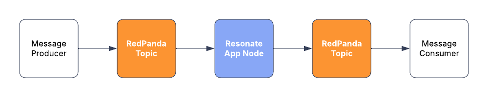

# Batch record deletion


## Resonate + Redpanda example application

This is an example app showcasing what a RedPanda + Resonate pipeline might look like in the context of a "batch record deletion" use case.

## Use case

Imagine a worker process that pulls messages from a queue, performs the requested task, and then pushes a completion message to another queue.

Problem one: head-of-line blocking.
If the first message kicks off a long operation—say, an hour—and the next one would only take 30 seconds, the shorter job gets stuck waiting. Unless the worker supports concurrency, this kills efficiency.

Problem two: crashes and repeat work.
If a task involves multiple steps and the worker crashes halfway through, it may redo already-completed steps when it restarts, leading to duplicate work or unintended side effects.

The bottom line is a worker node sitting between two queues should do two things well:

1. Handle tasks concurrently to stay efficient.
2. Resume cleanly after crashes to stay reliable.

This example application showcases an integration between RedPanda and Resonate where Resonate does both of those things, extending the durability RedPanda provides to span between the RedPanda topics and efficiently making progress on operations without blocking on the head-of-the-line message.



To illustrate these points, the Resonate Application Node in this example app pretends to be a process that deletes records. It pulls messages off a topic / queue, each message containing the ID of a record that needs to be permanently deleted. We don't know how much data is related the record ID, so the application simulates a random amount. Once the operation is complete, and the data deleted, the application node puts a new message onto a different queue where we can assume some other component would then take the next steps, perhaps notifying someone of deletion.

### Application flow details

In this example we have a producer script (record_producer) which creates a set of messages, each containing a unique ID, and puts the messages onto a RedPanda topic / queue named "records_to_be_deleted".

Then we have a consumer process (record_deletor) which pulls messages off the records_to_be_deleted topic / queue and simulates a batch deletion of data associated with the IDs. The application assumes that there is no way to know how much data there is to delete in relation to a record ID. So the `batch_delete()` function simulates the following:

1. A 25% chance of encountering an error while deleting the rows. This is to showcase Resonate's automatic function execution retry feature.
2. A 25% chance that any given batch deletion has deleted all remaining rows associated with the record ID.

The Resonate Application Node (record_deletor) pulls messages off the queue in the order in which the are placed there (FIFO) and kicks off a workflow for each message that it pulls off.

Once there is an indication that there are no more rows to delete associated with the record ID, the workflow will put a new message onto a different topic / queue which we can assume will be monitored by some other processing node that might notify someone or something that the data is deleted.
The message on that topic / queue will include the offset of produced message. This will enable us to see how the ordering changed with the first message off of the records_to_be_deleted topic / queue to the first message onto the records_that_were_deleted topic / queue.

The Resonate SDK is built so that new workflows can be invoked at any time, even if existing workflows are in progress.

### Recovery

This example is designed to demonstrate Resonate's ability to recover and resume progress on workflows.

While running the example app, try killing the record_deletor, then bring it back up and see the progress resume.

Or, try running multiple record_deletors and kill the one taking the lead. You will see the other one pick up and resume progress from where the other first one left off.

## How to run the example

This application uses [uv](https://docs.astral.sh/uv/) as the python environment and package manager.
This application requires Docker and Docker Compose.

Run the Resonate Server:

```shell
brew install resonatehq/tap/resonate
resonate serve
```

Install dependencies:

```shell
uv sync
```

Run the RedPanda in Docker:

```shell
cd redpanda && docker compose up
```

Set up the topics (optional, running the record_producer and record_deletor will automatically create the topics):

```shell
uv run setup-topics
```

Run the record_deletor:

```shell
uv run record-deletor
```

Create records:

```shell
uv run record-producer -n 25
```

You can provide any value for n.

### How to view records in RedPanda topics

RedPand provides a UI in which you can view the records / messages in the topic queues.

- url: http://localhost:8080

- username: the_dude
- password: white_russian

or

- username: neo
- password: white_rabbit

The record-producer script adds records to the records_to_be_deleted topic / queue.
The rcord-deletor pulls records from the records_to_be_deleted topic / queue and adds them to the records_that_were_deleted topic / queue.

### How to view Durable Promises in Resonate

You can use the Resonate CLI to view the status of a promise in the Resonate Server.
In this example app, the record ID is used as the Durable Promise ID.

By doing this, we ensure that no duplicate operations will ever happen for a given ID.

You can see the status of a specific workflow / Durable Promise with the following command:

```shell
resonate promises get "<id>"
```

For example:

```shell
resonate promises get "d1b8383d857344c1a74650bcdde82ed0"
```

Or you can see multiple promises using the search command. For example you use the wildcard to see all promises tracked by the Resonate Server:

```shell
resonate promises search "*"
```
